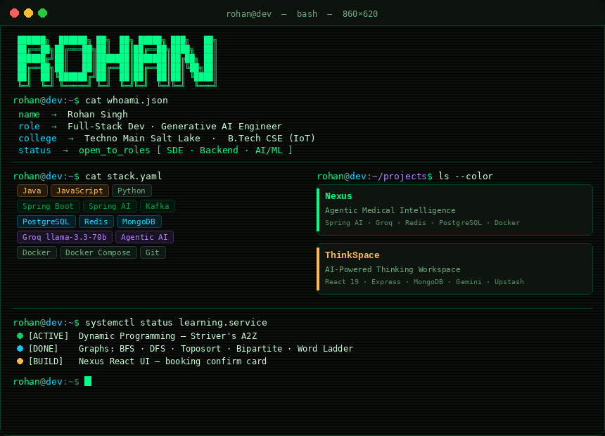

<div align="center">
  
</div>

<div align="center">


[](https://linkedin.com/in/rohan-kumar-singh-896b7931a/)
[](https://leetcode.com/rohannnsingh)
[](https://github.com/rohansingh-code)

</div>

---

## `$ ls -la ~/projects/ --color`

---

### `[ 01 ]` — Nexus · Agentic Medical Intelligence

```
Not a chatbot. A goal-directed reasoning agent.
```

Nexus is a production-grade agentic AI system built on a polyglot microservices stack. It perceives patient intent, plans a resolution path, autonomously invokes tools against live hospital APIs, manages multi-turn session state via Redis, and emits structured action signals to orchestrate client-side execution — all within a single conversational loop.

```
User Input
    │
    ▼
┌──────────────────────────────────────────────────┐
│ PERCEIVE  — load session history from Redis       │
└─────────────────────┬────────────────────────────┘
                      ▼
┌──────────────────────────────────────────────────┐
│ PLAN      — Groq LLM identifies intent           │
│             decides: tool call needed?            │
└──────────┬──────────────────────┬────────────────┘
      tool required          no tool needed
           ▼                       ▼
┌────────────────┐     ┌─────────────────────────────┐
│ ACT            │     │ RESPOND                     │
│ invoke tool →  │────►│ natural language +           │
│ getAvailable   │     │ [DOCTORS: {...}]             │
│ Doctors(spec)  │     │ [BOOKING_READY: {...}]       │
└────────────────┘     └─────────────────────────────┘
```

| Service | Responsibility |
|---|---|
| `hospitalManagement` | API gateway — JWT auth, RBAC, patient records, secure proxying |
| `ai-service` | Agent runtime — reasoning loop, tool registry, session state |
| PostgreSQL | Hard persistence — users, doctors, appointments |
| Redis | Ephemeral — AI conversation history, triage states |

```bash
docker-compose up --build
# Postgres → Redis → hospital-app:8080 → ai-service:8081
```

> `Spring Boot · Spring AI · Groq LLaMA-3 · Spring Security · JWT · PostgreSQL · Redis · Docker Compose · React`

---

### `[ 02 ]` — ThinkSpace · AI-Powered Thinking Workspace

```
Your thoughts, organized before you finish typing.
```

Full-stack MERN notes app that uses Gemini to auto-generate titles, summaries, and tags the moment you write. Ships with a glassmorphic Obsidian & Amber UI, smart search across content and AI-generated tags, HTTP-only JWT cookies, and a three-tier Upstash Redis rate limiter protecting the AI endpoints.

```
React 19 + Vite ──► Express.js ──► MongoDB (notes, users)
                        │
                        ├──► Gemini API    (title · summary · tags)
                        └──► Upstash Redis (rate limiting — 3 tiers)
```

> `React 19 · Vite · Tailwind CSS · Zustand · Express · MongoDB · Mongoose · Gemini · Upstash Redis · JWT`

---

## `$ git log --graph --oneline`

<div align="center">

<picture>
  <source media="(prefers-color-scheme: dark)" srcset="https://github-readme-activity-graph.vercel.app/graph?username=rohansingh-code&hide_border=true&area=true&bg_color=0a0d0a&color=00ff88&line=00ff88&point=ffffff&area_color=00cc6a" />
  <source media="(prefers-color-scheme: light)" srcset="https://github-readme-activity-graph.vercel.app/graph?username=rohansingh-code&hide_border=true&area=true&bg_color=f0fff4&color=0a6640&line=0a6640&point=0a6640&area_color=0a6640" />
  
</picture>

<br/>

<picture>
  <source media="(prefers-color-scheme: dark)" srcset="https://streak-stats.demolab.com/?user=rohansingh-code&hide_border=true&background=0a0d0a&ring=00ff88&fire=00cc6a&currStreakLabel=00ff88&sideLabels=c8ffd4&dates=6b9977&currStreakNum=ffffff&sideNums=ffffff" />
  <source media="(prefers-color-scheme: light)" srcset="https://streak-stats.demolab.com/?user=rohansingh-code&hide_border=true&background=f0fff4&ring=0a6640&fire=0a6640&currStreakLabel=0a6640&sideLabels=1f2328&dates=57606a&currStreakNum=1f2328&sideNums=1f2328" />
  
</picture>

<picture>
  <source media="(prefers-color-scheme: dark)" srcset="https://github-readme-stats.vercel.app/api/top-langs/?username=rohansingh-code&hide_border=true&bg_color=0a0d0a&title_color=00ff88&text_color=c8ffd4&layout=compact&count_private=true" />
  <source media="(prefers-color-scheme: light)" srcset="https://github-readme-stats.vercel.app/api/top-langs/?username=rohansingh-code&hide_border=true&bg_color=f0fff4&title_color=0a6640&text_color=1f2328&layout=compact&count_private=true" />
  
</picture>

</div>

---

## `$ ./run leetcode --user rohannnsingh --ext heatmap`

<div align="center">
  <a href="https://leetcode.com/rohannnsingh">
    
  </a>
</div>

```
[✓] Graphs   BFS · DFS · Cycle Detection · Topological Sort · Bipartite · Word Ladder
[✓] Arrays   Sliding Window · Two Pointer · Binary Search · Prefix Sum
[~] DP       Striver's A2Z — currently active  ← HERE
[ ] Tries    queued
```

---

<div align="center">

```
rohan@dev:~$ echo "let's build something that matters"
> available for SDE Intern · Backend · Full-Stack · AI Engineering roles
> reach out — response time: fast ⚡
```

</div>
